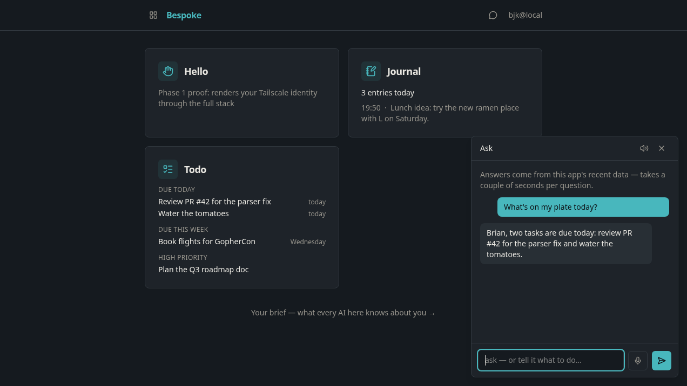
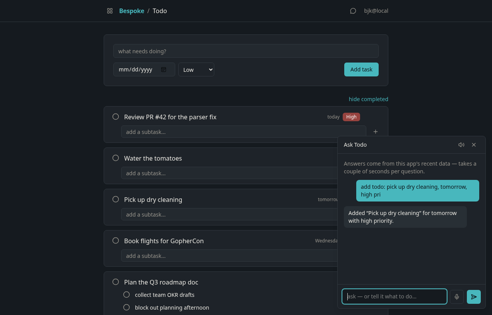

# Bespoke

Bespoke is a platform for software that exists for exactly one owner: a notes
stream that talks back, a todo list that knows the week, or whatever comes
next. Describe an app to an AI agent and run it on your own hardware, at its
own URL, behind your tailnet, styled like everything else in your instance.

The bet is that LLMs changed the economics of one-person software, and the
right response isn't more apps — it's a framework with opinions strong
enough that an agent can one-shot the next one. So Bespoke is mostly
conventions: one auth model (Tailscale identity at the edge — no login
screen will ever exist here), one storage pattern (SQLite file per app), one
design system, one deploy command, and a docs tree written for agents as
much as for me. In exchange, every app gets the expensive things for one
line of code each: chat grounded in its own data, local voice in and out, a
live card on the dashboard, and cross-app intents — highlight text in Notes
and "Create Todo" just appears.

This public repository is the versioned platform plus two synthetic showcase
apps, Notes and Todo. Personal apps, data, theme, and deployment configuration
belong in a separate private instance repository. Steal the idea before you
steal the code: the whole point is that yours should be bespoke too.

> **A thing nobody built:** Bespoke turned out to be multi-user. Identity
> comes from the tailnet at the edge, and every app was born asking "whose
> data?" — so each tailnet user gets their own notes, todos, and AI brief at
> the same URLs, with zero application-specific identity code. No one
> wrote that feature. The conventions did. That's the entire thesis of this
> repo in one accident.

## What it looks like

Ask the dashboard what matters — it reads every app and answers by name:

Or just tell it what to do. The task lands in the list _behind the panel,
live over SSE_ before the reply finishes settling:

## Start here

- **The docs:** [docs/README.md](docs/README.md) — every decision (ADRs),
  design doc, spec, and plan, cross-linked.
- **The architecture:** [docs/design/architecture.md](docs/design/architecture.md)
- **How agents build apps here:** [AGENTS.md](AGENTS.md) and
  [.agents/skills/](.agents/skills/)
- **What's next:** [docs/plans/roadmap.md](docs/plans/roadmap.md)
- **Making one?** Install the released CLI with
  `brew install --cask bketelsen/tap/bespoke` on macOS (Windows uses WSL2),
  then point your coding agent at [MAKE-IT-YOUR-OWN.md](MAKE-IT-YOUR-OWN.md).
  Your apps, theme, and deployment live in a private instance repository.

## LLM Generated, Human Driven

95% of this code was written by Claude Fable. All of the specifications, plans, visions and ADRs were written by a human. Your trust level should match this, or this isn't the repo for you.
